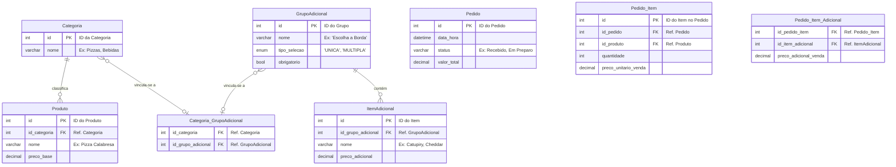

```mermaid

---
config:
  theme: light
  fontFamily: "Arial, sans-serif"
---
erDiagram
    %% --- SEÇÃO CARDÁPIO ---
    Categoria {
        int id PK "ID da Categoria"
        varchar nome "Ex: Pizzas, Bebidas"
    }
    Produto {
        int id PK "ID do Produto"
        int id_categoria FK "Ref. Categoria"
        varchar nome "Ex: Pizza Calabresa"
        decimal preco_base
    }
    GrupoAdicional {
        int id PK "ID do Grupo"
        varchar nome "Ex: 'Escolha a Borda'"
        enum tipo_selecao "'UNICA', 'MULTIPLA'"
        bool obrigatorio
    }
    ItemAdicional {
        int id PK "ID do Item"
        int id_grupo_adicional FK "Ref. GrupoAdicional"
        varchar nome "Ex: Catupiry, Cheddar"
        decimal preco_adicional
    }
    Categoria_GrupoAdicional {
        int id_categoria FK "Ref. Categoria"
        int id_grupo_adicional FK "Ref. GrupoAdicional"
    }
    Pedido {
        int id PK "ID do Pedido"
        datetime data_hora
        varchar status "Ex: Recebido, Em Preparo"
        decimal valor_total
    }
    Pedido_Item {
        int id PK "ID do Item no Pedido"
        int id_pedido FK "Ref. Pedido"
        int id_produto FK "Ref. Produto"
        int quantidade
        decimal preco_unitario_venda
    }
    Pedido_Item_Adicional {
        int id_pedido_item FK "Ref. Pedido_Item"
        int id_item_adicional FK "Ref. ItemAdicional"
        decimal preco_adicional_venda
    }

    %% --- RELACIONAMENTOS ---
    Categoria ||--o{ Produto : "classifica"
    GrupoAdicional ||--o{ ItemAdicional : "contém"
    Categoria }o--o| Categoria_GrupoAdicional : "vincula-se a"
    GrupoAdicional }o--o| Categoria_GrupoAdicional : "vincula-se a"
```

    Pedido ||--o{ Pedido_Item : "contém"
    Produto ||--o{ Pedido_Item : "é um"
    Pedido_Item ||--o{ Pedido_Item_Adicional : "possui"
    ItemAdicional ||--o{ Pedido_Item_Adicional : "é um"
